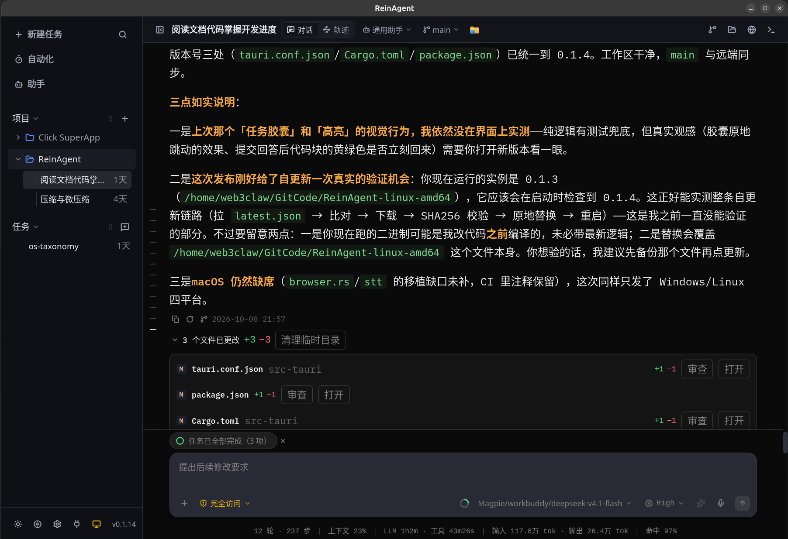

# ReinAgent

<p align="center">
  
</p>

<p align="center">
  <strong>高性能、自主可控的 Local-First 跨平台 AI 编程与桌面 Agent 工作台</strong>
</p>

<p align="center">
  
  
  
  
  
  
</p>

<p align="center">
  
</p>

---

## 🌟 核心理念与设计哲学

ReinAgent 致力于为开发者打造极致轻量、超高响应速度与 100% 自主可控的本地 AI 智能编程工作台。系统深度对标工业级顶级 AI 编程交互规范（融合 **ZCode** 的 UI/UX 与 **LiveAgent** 的底层工程架构）：

- **Local-First 数据自治**：所有会话历史、任务时间线、代码改动快照、模型密钥与配置均 100% 留存在本地（SQLite WAL + 本地 JSON），绝不上传云端，无任何中心化云服务依赖。
- **三端原生融合 & 绿色单文件即开即用**：针对 Linux (WebKitGTK)、Windows (WebView2) 和 macOS 进行深度原生适配；提供**免安装、免配任何环境（无需安装 Node.js / Python / Rust）的独立绿色单文件**，解压即跑。
- **No-Fallback & Fail-Fast（真实交互铁律）**：坚决拒绝静态硬编码猜测与虚假兜底掩盖。100% 真实解析服务端 API 返回的上下文窗口（`context_window`）、输出上限与多模态能力；网络或鉴权异常完整向用户报警，真实透明。
- **多智能体协作与持久上下文**：支持主智能体在复杂场景下派发独立子代理（Subagent）并行作业与任务隔离，结合本地长期记忆系统与动态水位线压缩，彻底杜绝单会话超长衰减。

---

## 🚀 核心特性全景

### 1. 三端原生适配与绿色单文件 (Cross-Platform & Portable)
- **绿色单文件 / 免安装即开即用**：
  - GitHub Releases 提供预编译绿色可执行文件（Linux AppImage / 可执行二进制、Windows 便携式 `.exe`、macOS 原生应用）；
  - **零环境依赖**：无需安装 Node.js、Python、Rust 等开发运行时，普通用户解压/双击直接运行。
- **三端底层深度融合**：
  - **Linux 专属优化**：支持 WebKitGTK 纯净渲染与 XWayland 原生窗口定位，支持通过 `xclip` / `wl-paste` 原生读取系统剪贴板图像，超长文本（≥15KB）自动转存为附件引用；
  - **Windows 专属优化**：WebView2 深度集成，控制台 GBK/UTF-8 字符集无损自适应转码，解决乱码难题；
  - **macOS 专属优化**：系统原生毛玻璃与圆角适配，无缝编译与稳定运行。
- **系统托盘与常驻生命周期**：
  - 支持关闭窗口最小化至系统原生托盘、后台静默运行；
  - 单实例守护机制（Single Instance Lock），防止重复开启多开冲突。

### 2. 多模式远程访问与安全公网隧道 (Remote Access)
- **三模网络架构自由切换**：
  - **局域网直连 (LAN)**：同一 Wi-Fi 内手机/平板/多设备直接扫码访问；
  - **Cloudflare 免配置安全公网隧道 (Cloudflare Quick Tunnel)**：
    - **无需公网 IP、免路由器端口映射、免注册任何账号**；
    - 后台自动拉起 Anycast 边缘安全隧道，生成全球合法的 `https://*.trycloudflare.com` 端到端加密域名；
    - 手机在任何地点使用 4G/5G 移动蜂窝网络直接扫码即连、实时审批与监控桌面 Agent。
  - **自定义公网域名 (Custom)**：支持配合个人 VPS 反向代理、FRP、Tailscale 绑定专属外部域名。
- **公网安全防护体系**：
  - **Fail2Ban 防爆破审计**：连续鉴权失败自动封禁异常 IP；
  - **真实 IP 穿透解析**：穿透 Cloudflare 边缘代理提取客户端真实公网 IP 进行安全审计；
  - **本地白名单保护**：严格豁免本地回环 `127.0.0.1` / `::1`，防止误拉黑本地代理导致服务瘫痪；
  - **世代守卫与进程回收**：内部采用进程世代守卫防状态竞争，应用退出时自动回收隧道子进程，防止孤儿进程暴露端口。

### 3. 全链路出站网络代理规范 (Unified Proxy Architecture)
- **全站流量统一走代理**：
  - 只要在应用中配置 HTTP/SOCKS 代理，软件内所有出站请求（大模型 API 交互、远程模型列表拉取、自更新检查、云端实时语音 STT、Web 抓取、Cloudflare 隧道组件下载）均一律严格走代理出网；
- **免代理白名单直连支持**：
  - 遵循「不使用代理的地址」规则，匹配本地服务（`localhost`、`127.0.0.1`、内部 Ollama 服务等）自动直连，不绕行代理；
- **环境自动同步**：
  - 自动向 WebView2 / 内置浏览器及终端拉起的子进程环境变量同步代理设置，避免终端工具在墙内拉取依赖超时。

### 4. 多智能体协作与子代理派发 (Subagents)
- **并行任务拆解与上下文隔离**：
  - 主 Agent 可根据需求自动派发子智能体（如代码审查员、独立调研员、特定模块重构员）；
  - 独立会话隔离，防止主智能体上下文被海量调研或长日志直接污染与撑爆；
- **转录面板与回放交互**：
  - 对话流中的 `agent` 及 `subagent_output` 工具卡片支持一键点击交互；
  - 点击即可在工作台右侧副边栏唤起子代理会话面板，全屏查看子代理的思考链、工具执行轨迹与输出结果。

### 5. 本地长期记忆系统 (Long-term Memory System)
- **自动经验沉淀**：
  - 会话交互过程中自动提取用户的个人偏好、编码规范、技术栈习惯并持久化落盘；
- **分层作用域隔离**：
  - 支持**全局记忆 (Global Memory)** 与 **项目级独立记忆 (Project Memory)**，既保证跨项目通用习惯延续，又防止特定项目的专有业务逻辑污染其他项目；
- **智能重构与防遗忘**：
  - 具备记忆审查、合并组织与冲突解决机制，让 Agent 随着使用越发默契。

### 6. 自动化编排与周期任务 (Automation)
- **计划任务与条件触发**：
  - 支持创建自动化流水线与周期性任务（Cron 调度）；
  - 具备自动化执行记录、日志流追溯与即时手动触发（Run Now）能力。

### 7. 智能交互与会话流（对齐 ZCode）
- **双层输入胶囊（LexicalComposer）**：
  - 富文本编辑、`@` 快速引用上下文文件/符号、`/` 斜杠内置与自定义命令扩展；
  - 支持多图粘贴与拖拽，超长文本（≥15KB）自动转存为附件引用。
- **任务级独立模型记忆**：
  - 多任务窗口完全隔离，切换任务自动还原专属模型与推理等级，新建任务不产生配置污染。
- **Reasoning Effort 6 档联动**：
  - 支持 `Default / Low / Medium / High / XHigh / Max` 6 档推理强度，与大模型步数（100~600 steps）及协议参数严格映射。
- **对话问题导航条（ConversationNavigator）**：
  - 浮动于消息区左侧，以用户提问为刻度，支持悬停双段预览、山峰衰减视觉动效与平滑视口定位。
- **任务进度与结构化交互**：
  - **任务清单胶囊（TaskProgressBar）**：多份 Todo 计划支持并排展示、圆环进度动态推进与 Popover 展开；
  - **交互式提问（AskQuestionCard）**：模型主动提问（`ask_user`）改版为单弹窗多 Tab 体验，支持收起为输入框悬浮徽章。

### 8. Agent 运行回路与安全审批
- **精细化工具集与尺寸闸门**：
  - 核心内置工具：`read_file`（2000行/256KB 上限）、`write_file`、`edit_file`、`list_dir`（8KB）、`exec_command`（30KB 内联收集）；
- **四档审批模式（ApprovalMode）**：
  - `plan`（计划模式，只读调研拦截修改）、`ask`（变更前审批）、`edit`（自动放行编辑，执行命令弹窗）、`full`（完全访问直通）；
  - 基于 `beforeToolCall` 挂起机制，审批触发时 Agent 运行回路安全暂停，用户决策后即时恢复；
- **代码改动检查点与原子回退（Checkpoint & Rewind）**：
  - 文件修改前由 Rust 后端自动留存前像，UI 支持逐轮代码改动撤销，具备 SHA-256 指纹 TOCTOU 冲突防护。

### 9. 真实多协议接入与零猜测铁律
- **多协议原生适配**：支持 `Chat Completions (/chat/completions)`、`Anthropic Messages (/v1/messages)`、`Responses (/responses)` 与 `Google Generative AI (/models)` 协议；
- **Fail-Fast 连通性探测**：切换 API 格式即发起真实握手探测，Base URL 规范化清洗与自动追加 `/v1`；
- **主流预设与自定义端点**：预设 DeepSeek、OpenAI、Anthropic Claude、Google Gemini、Ollama、SiliconFlow 等，并支持自由添加自定义兼容服务商。

### 10. 内置浏览器与 Web 自动化
- **无头与内嵌双模式**：
  - 支持内嵌浏览器页面导航、DOM 交互与状态调试；
  - 提供 `web_fetch` 与 `web_search` 网页阅读工具，自动将 HTML 清洗转换为结构化 Markdown 供模型深度分析；
  - 支持视口尺寸调节与页面视觉截图捕获。

### 11. 轨迹分析与请求预览（对齐 LiveAgent）
- **轨迹视图（TrajectoryView）**：
  - 对话顶部支持无缝切换「对话 / 轨迹」模式；
  - 提供三泳道时间轴（输入/模型/工具）、表格视图与 8 Tab 详情面板，精确呈现 TTFT 首包耗时、工具消耗与 Token 用量；
- **下一次请求预览**：
  - 与真实发送共享同源装配逻辑（`assembleTurnContext`），发送前即可完整预览系统提示词、工具定义、上下文结构与原始请求 JSON。

### 12. 上下文预算与防截断机制
- **微压缩（Microcompact）**：非侵入式裁剪历史工具结果文本块，不破坏磁盘与 UI 原始数据，确保报文不超限；
- **动态水位线**：基于 `contextWindow - maxOutputTokens` 计算真实可用空间（70% 水位线自动压缩），本地反代放宽至 32MB 护栏，根除超长会话断连。

### 13. Git 工作台与生态扩展
- **Git 工作台集成**：
  - 顶栏分支快速检出与新建、未暂存/已暂存行级差异对比；
  - 集成 AI 提交信息生成（`CommitDialog`）与空目录一键初始化仓库；
- **实时语音输入（STT）**：
  - 支持腾讯云、火山引擎、百度千帆、阿里 DashScope 实时语音 WebSocket 流式转写，输入框草稿无缝接续；
- **生态导入与 Skills/MCP**：
  - 一键从 Claude Code、Codex、OpenCode、Pi 导入历史会话、模型配置、技能与 MCP 服务器；
  - 支持 Model Context Protocol (MCP) 与 ClawHub 技能生态；
- **双配色主题**：
  - 内置 AntiGravity 与 OpenCode 两种消息配色体系，全系统遵循 Tailwind CSS v4 语义变量换肤。

---

## 🏗️ 系统架构

```
ReinAgent 架构全景
├── Frontend (React 19 + TypeScript + Tailwind CSS v4)
│   ├── src/App.tsx                      # 根容器、全局快捷键、主视口分流 (Workbench / Settings)
│   ├── src/store/useAppStore.ts         # 全局响应式状态 (主题、语言、任务、工作区项目)
│   ├── src/components/
│   │   ├── chat/                        # 输入胶囊、消息流、回合分组、审批卡、导航条、子代理卡片
│   │   ├── trajectory/                  # 轨迹视图、时间轴泳道、详情面板
│   │   ├── git/                         # 分支切换器、Git 图谱、提交对话框
│   │   ├── sidebar/                     # 侧边栏主体、项目与任务树、长按拖拽重排
│   │   └── settings/                    # 模型服务商、语音输入、导入工作台、远程访问、代理设置
│   └── src/lib/
│       ├── chat/                        # conversationPool (会话池), conversationModel (状态机)
│       ├── providers/                   # runAgentTurn, modelFactory, assembleTurnContext
│       ├── storage/                     # db.ts (SQLite 内存缓存 + 防抖写透)
│       └── agent/                       # agentRuntime, 核心工具集, 路径决议
│
└── Backend (Tauri 2 / Rust)
    └── src-tauri/src/
        ├── lib.rs                       # Tauri 命令注册、应用生命周期与退出钩子
        ├── conversation_store.rs        # SQLite (WAL) 会话与任务持久化
        ├── checkpoint.rs                # 检查点创建、差异比对与代码原子回退引擎
        ├── fs_cmd.rs                    # 异步受控文件操作、原生文件夹选择、系统管理器调起
        ├── git_panel.rs                 # Git 分支、状态、提交与推送命令
        ├── remote_server.rs             # 远程 Axum HTTP/WebSocket 远控服务与真实 IP 审计
        ├── remote_tunnel.rs             # Cloudflare Quick Tunnel 世代守卫与安全下载管理
        ├── app_proxy.rs                 # 全局出站网络代理配置注入与白名单校验
        ├── browser.rs                   # 内置无头/内嵌浏览器控制与截图
        ├── terminal.rs                  # 跨平台伪终端 (PTY) 会话管理
        └── clipboard_image.rs           # Linux 剪贴板原生图像读取适配
```

---

## 📦 技术栈与依赖

- **前端框架**：React 19 + TypeScript 6 + Vite
- **样式与组件**：Tailwind CSS v4 + Radix UI 原语 + Lucide Icons + Motion
- **编辑器与渲染**：Lexical 富文本 + Marked + Shiki (代码高亮) + @pierre/diffs
- **虚拟化与状态**：@tanstack/react-virtual + Zustand
- **桌面与后端**：Tauri 2 (Rust) + Axum + SQLite (rusqlite) + Tokio
- **包管理器**：[Bun](https://bun.sh) (`bun@1.4.2`)

---

## 💻 环境要求

### 普通用户（直接运行）
- **下载即用**：直接前往 [Releases 页面](../../releases) 下载对应系统的绿色安装包或单文件，**无需安装任何运行时**。
- **支持操作系统**：
  - **Linux**：Ubuntu 22.04+ / Debian 12+ / Arch / Fedora 等（主流发行版均已内置 `webkit2gtk`）；
  - **Windows**：Windows 10 / 11（自带 Microsoft Edge WebView2 运行时）；
  - **macOS**：macOS 12 Monterey 及以上。

### 开发者（二次开发与编译）
- [Bun](https://bun.sh) ≥ 1.1（建议严格使用 `bun@1.4.2`）
- [Node.js](https://nodejs.org) ≥ 20（用于运行部分 Node 原生测试）
- [Rust](https://rustup.rs) (stable)

---

## 🛠️ 快速上手（开发者）

### 1. 安装依赖
```bash
bun install
```

### 2. 开发模式运行
启动前端开发服务器与 Tauri 桌面窗口：
```bash
bun run tauri dev
```

### 3. 代码验证与单元测试
ReinAgent 配备了严谨的分域单元测试矩阵：

```bash
# 执行全部关键子领域前端测试
bun run test:chat               # 会话模型、控制器、导航条、状态机测试
bun run test:providers          # 模型工厂、审批门、工具策略测试
bun run test:agent              # Agent 运行时、工具集、工作区路径决议测试
bun run test:git                # Git 分支切换与冲突处理逻辑测试
bun run test:hub                # 技能中心与 MCP 注册表测试
bun run test:settings           # 设置项持久化测试
bun run test:markdown           # Markdown 渲染块解析测试
bun run test:assistants         # 助手人设解析测试
bun run test:import             # 外部生态会话与配置导入测试
bun run test:promptEnhancement  # 提示词增强模板与流式生成测试

# 全局 TypeScript 类型检查
bun run tsc --noEmit

# Rust 后端类型与命令检查
cargo test --manifest-path src-tauri/Cargo.toml
```

### 4. 生产打包构建
```bash
# 构建正式可分发安装包 (产物输出至 src-tauri/target/release/bundle/)
bun run tauri build
```

---

## 📁 目录结构

```
ReinAgent/
├── src/                          # 前端源代码
│   ├── assets/                   # 静态字体、图标等资源
│   ├── components/               # React UI 组件 (chat, settings, sidebar, git, trajectory 等)
│   ├── hooks/                    # 通用 React Hooks
│   ├── i18n/                     # 中英双语国际化字典
│   ├── lib/                      # 核心业务逻辑 (agent, chat, providers, git, stt, storage 等)
│   ├── preview/                  # 右侧代码与差异预览面板组件
│   ├── store/                    # Zustand 全局 Store (useAppStore.ts)
│   ├── styles/                   # 全局样式与 CSS 语义主题变量 (global.css)
│   ├── App.tsx                   # 顶层工作台与视图路由
│   └── main.tsx                  # 应用入口与数据存储初始化
├── src-tauri/                    # Tauri 2 / Rust 后端
│   ├── src/                      # Rust 核心模块 (存储, 检查点, 文件, Git, 远控, 代理, PTY 等)
│   ├── icons/                    # 各分辨率桌面图标
│   ├── Cargo.toml                # Rust 依赖声明
│   └── tauri.conf.json           # Tauri 应用配置
├── docs/                         # 项目文档专区
│   ├── PROJECT_CONTEXT.md        # 核心全景架构白皮书 (Single Source of Truth)
│   ├── PROMPTS.md                # 系统提示词单一真相源
│   ├── ReinAgent.png             # 界面展示高清预览图
│   └── archived/
│       └── ROADMAP.md            # 历史功能路线图归档
├── AGENTS.md                     # Agent 工作区指令与规则单一真相源
├── LICENSE                       # MIT 开源协议
└── package.json                  # 项目依赖与运行脚本
```

---

## 🔒 隐私与本地数据说明

- **配置存储**：模型 API Key 存储在本地文件 `~/.ReinAgent/provider_config.json`，不会上传任何三方服务器。
- **对话与任务库**：任务元数据与时间线持久化在本地 SQLite 数据库 `~/.ReinAgent/conversations.db`。
- **代码检查点**：代码修改前快照保存在 `~/.ReinAgent/checkpoints/<taskId>/`，仅供本机会话回退使用。
- **默认工作区**：未指定项目时，默认在 `~/.ReinAgent/DefaultProject/` 开展工作。

---

## 📄 开源许可证

本项目基于 [MIT License](LICENSE) 开源。
