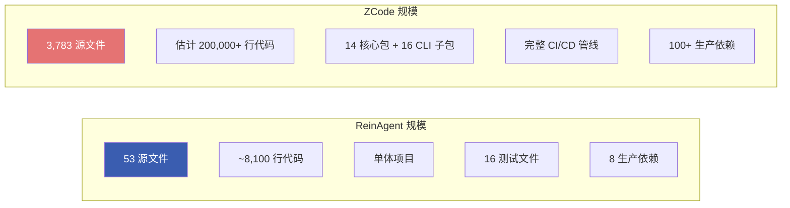
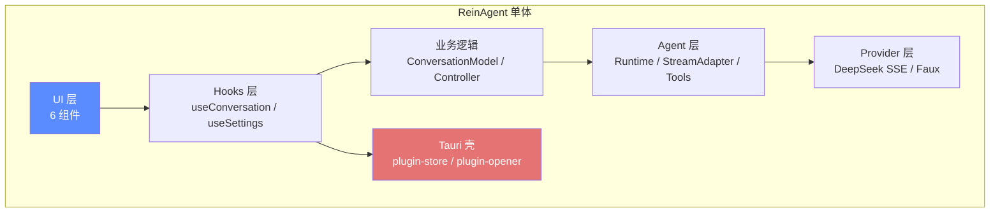
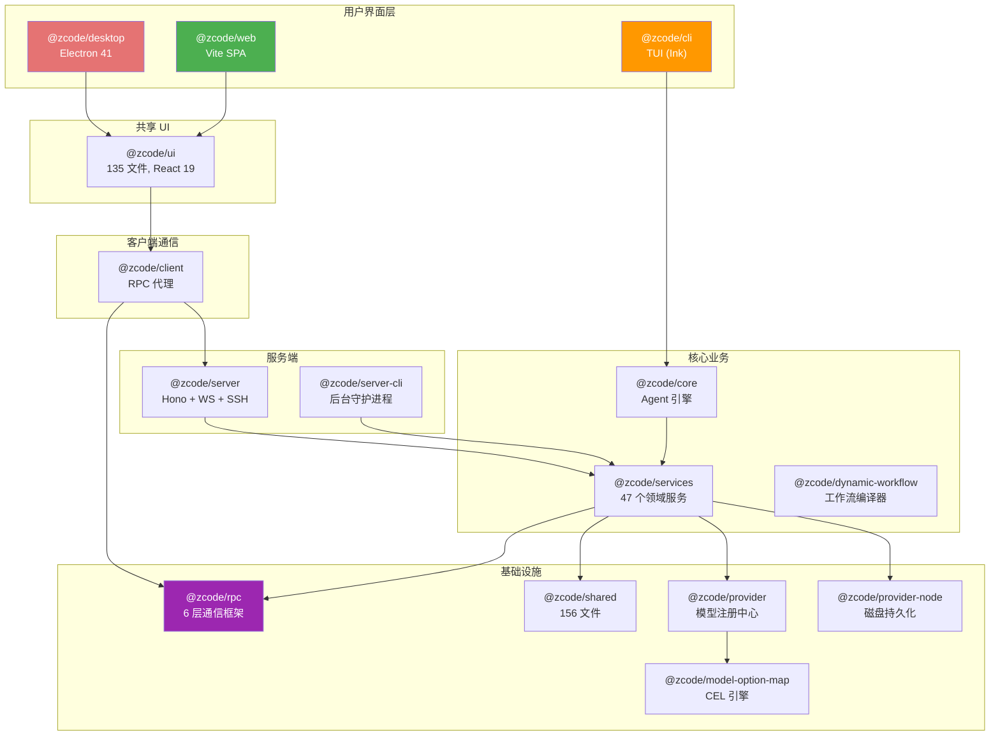
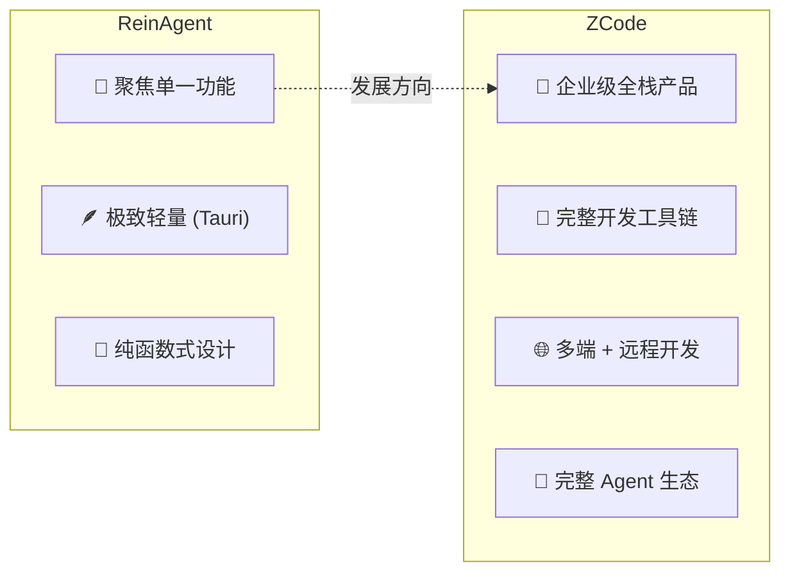

# ReinAgent vs ZCode 深度对比分析报告

## 一、项目定位一览

| 维度 | ReinAgent | ZCode |
|------|-----------|-------|
| **定位** | 个人桌面 AI 聊天助手 | AI 编程工作台（IDE 级产品） |
| **版本** | 0.1.0 (初始阶段) | 3.14.0 (成熟产品) |
| **许可证** | 未声明 | Apache-2.0 |
| **运行形态** | 桌面应用 (Tauri) | 桌面(Electron) + Web + CLI/TUI |
| **AI 模型** | 仅 DeepSeek | OpenAI / Anthropic / Gemini / DeepSeek / Ollama 等 |
| **核心能力** | 流式对话 + 简单工具调用 | 完整 Agent 系统 (代码编辑、终端、Git、SSH、浏览器自动化) |
| **UI 语言** | 中文 | 中英文 (i18n) |
| **社区** | 个人项目 | 飞书 + Discord 社群 |

---

## 二、规模与复杂度对比

| 指标 | ReinAgent | ZCode | 倍差 |
|------|-----------|-------|------|
| **TS/TSX 源文件** | 53 | 3,783 | ~71x |
| **代码行数** | ~8,100 | ~200,000+ | ~25x |
| **Workspace 包** | 1 (单体) | 14 + 16 = 30 | - |
| **Git 提交** | 活跃开发中 | 872ad96 (feat: open source) | - |
| **package.json 大小** | 47 行 | 94 行 (根) + 30 个子包 | - |

---

## 三、技术栈深度对比

### 3.1 运行时与桌面框架

| 层面 | ReinAgent | ZCode |
|------|-----------|-------|
| **桌面框架** | **Tauri v2** (Rust 壳 + WebView) | **Electron 41** (Chromium + Node.js) |
| **原生代码** | Rust (极薄壳，仅插件注册) | Node.js (大量原生模块: node-pty, ssh2, koffi) |
| **打包体积** | 极小 (~5-15MB) | 较大 (~150-300MB) |
| **内存占用** | 低 (WebView 共享) | 高 (Chromium 独立进程) |
| **跨平台** | macOS / Windows / Linux | macOS / Windows / Linux |
| **移动端** | Tauri 支持 (未启用) | 不支持 |

> [!NOTE]
> ReinAgent 选择 Tauri 追求极致轻量，所有逻辑在前端 TypeScript 中完成。ZCode 选择 Electron 获得完整的 Node.js 运行时，支撑终端、Git、SSH 等重量级功能。

### 3.2 前端框架

| 层面 | ReinAgent | ZCode |
|------|-----------|-------|
| **UI 框架** | React 19 | React 19 |
| **状态管理** | `useState` + 自定义 StateBridge | Zustand |
| **CSS 方案** | 手写 CSS + CSS Variables | Tailwind CSS v4 + Radix UI |
| **Markdown** | react-markdown + remark-gfm | Shiki + Streamdown (流式高亮) |
| **富文本编辑** | 原生 `<textarea>` | Lexical (@ 提及、/ 命令、图片附件) |
| **终端** | 无 | XTerm.js + node-pty |
| **Diff 渲染** | 无 | @pierre/diffs + Shiki |
| **构建工具** | Vite 8 | Vite 8 + tsup + esbuild |
| **包管理器** | Bun 1.4.2 | pnpm 10.33.2 |

### 3.3 后端与通信

| 层面 | ReinAgent | ZCode |
|------|-----------|-------|
| **后端运行时** | 无 (纯前端 + Tauri IPC) | Hono HTTP/WS 服务器 (Node.js) |
| **IPC 框架** | Tauri invoke (简单 RPC) | 自研 VS Code 风格 RPC 框架 (@zcode/rpc) |
| **通信协议** | 直接 HTTP → DeepSeek API | WebSocket / MessagePort / Stdio 多路复用 |
| **远程开发** | 不支持 | SSH / WSL / Docker 远程连接 |
| **数据持久化** | tauri-plugin-store (JSON 文件) | SQLite + 文件系统 + OS Keychain |

---

## 四、AI 能力对比

### 4.1 模型集成

| 特性 | ReinAgent | ZCode |
|------|-----------|-------|
| **Provider 架构** | 硬编码 DeepSeek + Faux | 插件化 Provider 注册中心 |
| **支持模型** | DeepSeek (deepseek-chat 等) | OpenAI / Anthropic / Gemini / DeepSeek / Ollama / 自定义 |
| **模型配置** | API Key + Model ID + Base URL | CEL 表达式动态映射参数 (@zcode/model-option-map) |
| **Provider 持久化** | 明文 JSON | 加密存储 + 远程同步 |
| **Credential** | 前端 plugin-store | node-forge + OS keychain |

### 4.2 Agent 能力

| 能力 | ReinAgent | ZCode |
|------|-----------|-------|
| **工具调用** | `get_current_time` + `calculate` (2 个) | 文件读写、Bash 执行、Git、搜索、浏览器自动化等 20+ 工具 |
| **多步推理** | 最多 8 步 (DEFAULT_MAX_STEPS) | 可配置，支持无限步 |
| **子 Agent** | 不支持 | 层级化子 Agent 系统 (协调器/工作者模式) |
| **动态工作流** | 不支持 | TypeScript 运行时编译 + 沙盒 VM 执行 |
| **Computer Use** | 不支持 | CUA (桌面 GUI 自动化) |
| **浏览器自动化** | 不支持 | Playwright 集成 |
| **MCP 支持** | 不支持 | 完整 MCP Server 生命周期管理 |
| **权限控制** | 无 | 4 级权限模型 (yolo/build/edit/plan) |
| **上下文压缩** | 无 | 自动上下文压缩 + token 限制 |
| **技能系统** | 无 | Skills 发现、验证、执行 |
| **插件市场** | 无 | 官方 + 社区插件生态 |

---

## 五、架构设计对比

### 5.1 ReinAgent — 简洁的分层架构

**特点**：
- 纯函数式状态机设计
- 所有逻辑在前端 TypeScript 中
- Tauri 仅提供窗口管理和持久化
- 单一数据流，简单直接

### 5.2 ZCode — 企业级 Monorepo 架构

**特点**：
- VS Code 风格多进程 RPC 架构
- 严格的 browser/node 代码隔离
- 47 个独立领域服务
- 远程开发 (SSH/WSL/Docker) 支持
- 形式化验证 (@zcode/formal-proof)

---

## 六、UI 与设计体系对比

| 维度 | ReinAgent | ZCode |
|------|-----------|-------|
| **设计文档** | 无 | [DESIGN.md](file:///home/web3claw/DevCode/ReinAgent/ZCode/DESIGN.md) — 538 行完整设计系统 |
| **主题** | 仅深色 (硬编码) | Light / Dark / Zai Light / Zai Dark + System |
| **CSS 框架** | 手写 CSS (单文件 ~11KB) | Tailwind CSS v4 + 语义 Token 体系 |
| **组件库** | 6 个自定义组件 | Radix UI + 135 个共享组件 |
| **排版体系** | 系统字体，固定大小 | `text-ui-*` 7 级可缩放 Token |
| **间距系统** | 无规范 | 4px 基础单位，5 级韵律 |
| **圆角规范** | `--radius: 10px` 全局统一 | 5 级嵌套容器递降 (2xl → xl → lg → md → sm) |
| **无障碍** | 未考虑 | 键盘导航优先 + 焦点管理 + 对比度保证 |
| **国际化** | 未考虑 (中文硬编码) | 完整 i18n 支持 (中/英) |
| **字体缩放** | 不支持 | `--ui-font-size` 可调 |

---

## 七、测试与工程治理对比

| 维度 | ReinAgent | ZCode |
|------|-----------|-------|
| **Lint** | 无 | oxlint (Rust 高速 Linter) |
| **格式化** | 无 | oxfmt |
| **架构治理** | 无 | `architecture-policy.yaml` + 自动检查 |
| **文件长度限制** | 无 | 严格 400 行上限 |
| **循环依赖** | 未检查 | 自动检测并禁止 |
| **死代码检测** | 无 | knip (未使用导出/依赖) |
| **代码审计** | 无 | AGENTS.md (AI Agent 工作规范) |
| **形式化验证** | 无 | @zcode/formal-proof (D3 状态空间可视化) |
| **发布管理** | 手动 | release-it + conventional changelog |
| **Git Hooks** | 无 | husky + lint-staged |

---

## 八、安全模型对比

| 维度 | ReinAgent | ZCode |
|------|-----------|-------|
| **API Key 存储** | ⚠️ **明文 JSON** | ✅ node-forge 加密 + OS Keychain |
| **CSP** | ⚠️ `null` (无限制) | 配置化管理 |
| **XSS 防护** | ✅ 禁用 rehype-raw | ✅ 多层防护 |
| **Agent 权限** | ❌ 无权限控制 | ✅ 4 级权限模型 |
| **网络安全** | 直接调用外部 API | 出口守卫 + 缓存 |
| **环境变量** | 前端暴露 | 运行时消毒 (applyCliRuntimeEnvSanitization) |
| **Workspace Hook** | 不支持 | 信任审计系统 |

---

## 九、核心依赖对比

### ReinAgent (精简)

| 依赖 | 用途 |
|------|------|
| `@earendil-works/pi-agent-core` | Agent 核心 |
| `@earendil-works/pi-ai` | AI 通信 |
| `react` / `react-dom` 19 | UI |
| `react-markdown` + `remark-gfm` | Markdown |
| `@tauri-apps/*` | 桌面壳 |
| `typebox` | Schema |

### ZCode (丰富)

| 类别 | 关键依赖 |
|------|----------|
| **桌面** | Electron 41, electron-updater |
| **UI** | React 19, Tailwind v4, Radix UI, Zustand, Lexical, Lucide, Motion |
| **通信** | 自研 @zcode/rpc, ws, ssh2, undici |
| **AI SDK** | @ai-sdk/openai-compatible, @ai-sdk/anthropic |
| **终端** | @xterm/xterm, node-pty |
| **编辑器** | Shiki, Streamdown, @pierre/diffs |
| **预览** | pdfjs-dist, react-pdf, Docx/Xlsx/Pptx 渲染器 |
| **构建** | Vite 8, tsup, esbuild, turbo |
| **质量** | oxlint, oxfmt, knip, husky, release-it |
| **遥测** | OpenTelemetry, @arms/rum-electron |

---

## 十、总结与发展建议

### 项目本质差异

### ReinAgent 的独特优势
1. **极致轻量** — Tauri 打包仅 5-15MB，远小于 Electron 的 150MB+
2. **纯函数式设计** — ConversationModel 不可变状态机，代码质量密度高
3. **学习门槛低** — 单体架构 + 中文注释，适合学习和快速迭代

### ZCode 的独特优势
1. **产品完整度** — 从 IDE 到 Agent 到远程开发，形成闭环生态
2. **架构治理** — 自动化架构守卫、形式化验证、严格的代码规范
3. **多端一致** — Desktop / Web / CLI 共享核心 UI 和业务逻辑
4. **可扩展性** — 插件市场 + MCP + Skills + 动态工作流

### 如果 ReinAgent 想向 ZCode 方向演进

> [!IMPORTANT]
> 以下是渐进式演进路径，不建议一次性重构。

| 阶段 | 目标 | 参考 ZCode 实践 |
|------|------|-----------------|
| **P0** | 安全加固 | 加密 Key 存储、配置 CSP |
| **P1** | 多 Provider | 抽象 Provider 接口，支持 OpenAI/Anthropic |
| **P2** | 工具扩展 | 增加文件读写、代码执行等实用工具 |
| **P3** | 状态持久化 | 会话历史本地存储 + SQLite |
| **P4** | 国际化 | i18n 框架，支持中英文 |
| **P5** | 架构分包 | 拆分 monorepo，分离 UI/Core/Provider |
| **P6** | Agent 系统 | 权限控制、子 Agent、上下文压缩 |
