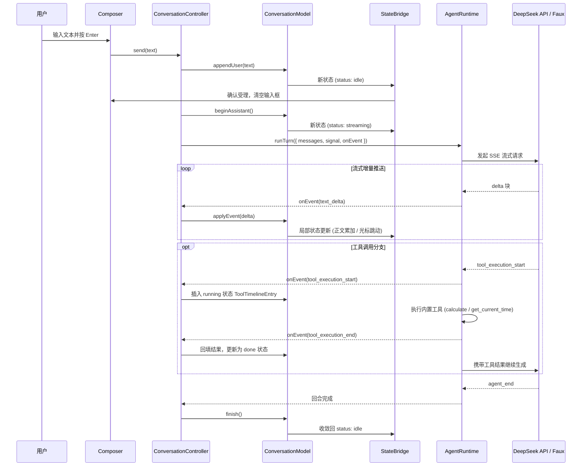

# ReinAgent 项目深度架构分析报告

- **记录日期**：260721 (2026-09-21)
- **目标工程**：ReinAgent
- **核心定位**：基于 Tauri v2 + React 19 + TypeScript 6 的轻量级桌面 AI 聊天助手

---

## 一、项目概览

**ReinAgent** 是一款桌面级 AI 聊天助手应用，主要对接 **DeepSeek** 大模型 API，支持流式对话、工具调用（Function Calling）以及无 API Key 时的离线演示模式。

| 维度 | 详情 |
|------|------|
| **名称** | ReinAgent |
| **版本** | 0.1.0 |
| **技术栈** | Tauri v2 (Rust) + Vite 8 + React 19 + TypeScript 6 |
| **包管理器** | Bun 1.4.2 |
| **前端源文件** | 53 个文件，约 8,100 行代码 |
| **核心依赖** | `@earendil-works/pi-agent-core` + `@earendil-works/pi-ai` (v0.86.0) |
| **UI 语言** | 中文 |
| **默认主题** | 深色 (Dark) |

---

## 二、系统架构图

```mermaid
graph TB
    subgraph "Tauri 原生壳 (Rust)"
        TauriCore["Tauri v2 Core"]
        PluginStore["tauri-plugin-store<br/>本地持久化"]
        PluginOpener["tauri-plugin-opener<br/>系统打开器"]
    end

    subgraph "前端应用 (React + TypeScript)"
        subgraph "UI 层"
            App["App.tsx<br/>主布局"]
            Topbar["Topbar<br/>标题栏 + 模式徽章"]
            ProviderForm["ProviderForm<br/>设置面板"]
            MessageList["MessageList<br/>消息列表"]
            MessageItem["MessageItem<br/>单条消息"]
            MarkdownText["MarkdownText<br/>Markdown 渲染"]
            ToolCallCard["ToolCallCard<br/>工具调用卡片"]
            Composer["Composer<br/>输入栏"]
            EmptyState["EmptyState<br/>空状态引导"]
        end

        subgraph "业务逻辑层 (src/lib)"
            useConversation["useConversation<br/>对话 Hook"]
            ConvModel["ConversationModel<br/>纯函数状态机"]
            ConvController["ConversationController<br/>编排器"]
            StateBridge["StateBridge<br/>状态同步桥"]
            AgentRuntime["AgentRuntime<br/>Agent 薄封装"]
            StreamAdapter["StreamFnAdapter<br/>流适配器"]
            Tools["Tools<br/>工具定义与执行"]
            RunAgentTurn["runAgentTurn<br/>SSE 流式通信"]
            FauxSource["fauxSource<br/>演示 Provider"]
            Catalog["catalog<br/>模型目录"]
            ModelFactory["modelFactory<br/>模型工厂"]
            Settings["settingsStore<br/>设置管理"]
            MarkdownBlocks["markdownBlocks<br/>块级解析"]
        end
    end

    App --> Topbar
    App --> ProviderForm
    App --> MessageList
    App --> Composer
    App --> EmptyState
    MessageList --> MessageItem
    MessageItem --> MarkdownText
    MessageItem --> ToolCallCard
    MarkdownText --> MarkdownBlocks

    App --> useConversation
    useConversation --> ConvModel
    useConversation --> AgentRuntime
    useConversation --> ConvController
    ConvController --> StateBridge

    AgentRuntime --> StreamAdapter
    AgentRuntime --> Tools
    AgentRuntime --> RunAgentTurn
    AgentRuntime --> FauxSource
    RunAgentTurn --> Catalog
    RunAgentTurn --> ModelFactory

    ProviderForm --> Settings
    Settings --> PluginStore

    classDef rust fill:#2d2d2d,stroke:#e57373,color:#fff
    classDef ui fill:#1a237e,stroke:#5b8cff,color:#fff
    classDef logic fill:#1b5e20,stroke:#66bb6a,color:#fff

    class TauriCore,PluginStore,PluginOpener rust
    class App,Topbar,ProviderForm,MessageList,MessageItem,MarkdownText,ToolCallCard,Composer,EmptyState ui
    class useConversation,ConvModel,ConvController,StateBridge,AgentRuntime,StreamAdapter,Tools,RunAgentTurn,FauxSource,Catalog,ModelFactory,Settings,MarkdownBlocks logic
```



---

## 三、核心模块详解

### 3.1 对话状态管理 (`src/lib/chat/`)

这是项目最核心的模块，采用**纯函数式不可变状态机**设计：

#### 1. `ConversationModel`
- **设计模式**：每个方法返回全新的 `ConversationState`，不修改原有状态，天然适配 React 的不可变数据流。
- **核心状态**：`{ messages: Message[], status: 'idle' | 'streaming' | 'error', error?: string }`
- **关键方法**：
  - `addUserMessage(text)`：追加用户消息，重置为 idle。
  - `startAssistant()`：进入 streaming 状态，准备接收增量。
  - `appendDelta(chunk)`：正文文本仅由 `text_delta` 的 `delta` 字段累加，思考内容流经 `thinking` 字段。
  - `commitAssistant()`：助手消息完成收敛。
  - `addToolResult(callId, result)`：追加工具执行结果。
  - `toApiMessages(state)`：将时间线投影为下游模型可消费的 `Message[]`（包含孤儿工具结果补全与未完成助手消息剪枝保护）。

#### 2. `ConversationController`
- **编排层**：连接 Model ↔ Runtime，管理流式生命周期、用户主动中断（AbortController）及新对话重置。
- **忙判定**：始终从同步状态派生判定忙碌（`status === "streaming"`），避免同 tick 重复触发。

#### 3. `StateBridge`
- 解决 React 异步渲染与状态机同步推进之间的时序差，实现单点同步真相源。

#### 4. `toolDisplay`
- 工具参数的展示格式化：包含循环引用保护、异常 Proxy 兜底、控制字符转义与 Unicode 码点安全截断（不切断代理对）。

---

### 3.2 Agent 运行时 (`src/lib/agent/`)

#### 1. `AgentRuntime`
- 对 `@earendil-works/pi-agent-core` 的 `Agent` 类的单轮薄封装。
- 每次调用均创建新 `Agent` 实例，天然规避并发冲突。
- 桥接外部 `AbortSignal` 到 `agent.abort()`，保证工具执行可随时被打断。

#### 2. `StreamFnAdapter`
- 解决 `pi-agent-core` 的通用 `Model<Api>` 与特定的 `Model<"openai-completions">` 参数类型收窄问题，实现零副作用透传。

#### 3. `Tools`
- 预置工具：`get_current_time`（时钟可注入）、`calculate`（手写递归下降求值器，严禁 `eval`）。
- 硬闸保护：模型回传文本最大 8KB（UTF-8 字符安全截断）、表达式长度限制 256、括号嵌套限制 32 层、默认最大步数 8 步。

---

### 3.3 Provider 层 (`src/lib/providers/`)

#### 1. `runAgentTurn`
- 实现 DeepSeek 的 SSE (Server-Sent Events) 流式通信协议。
- **运行时导入纪律**：严禁从桶文件导入，一律使用具体子路径动态导入，防止将 Node.js 内置依赖打包进浏览器 Bundle。

#### 2. `fauxSource`
- 无需 API Key 时的合成演示数据源，基于微任务模拟真实的逐字流式打字与工具调用卡片闭环。

#### 3. `catalog` & `modelFactory`
- 引入 DeepSeek 官方模型目录元数据（ID、名称、上下文窗口、推理能力等），并对用户的 API Key 进行前后空格清理（trim）以避免鉴权失败。

---

### 3.4 设置管理 (`src/lib/settings/`)

- **`settingsStore`**：管理 API Key、模型选择与 Base URL。
- **优雅降级机制**：在 Tauri 环境下持久化到 `settings.json`；在纯浏览器开发环境下后端失败时自动退化为内存模式并告警，保证界面绝不崩溃。

---

### 3.5 Markdown 渲染优化 (`src/lib/markdown/`)

#### `markdownBlocks`
- **痛点**：长文本流式打字期间，整篇 Markdown 全量重解析会导致界面严重掉帧。
- **优化机制**：纯函数 `splitBlocks` 将文档切分为顶层块，配合 React Memo 实现块级增量渲染——流式期间仅重解析末尾活动块，将开销降低至 $O(1)$。
- **语义回退**：若探测到链接引用定义、GFM 脚注等文档作用域构造，自动退回单块解析保证语义不丢失。

---

## 四、UI 组件架构

### 4.1 布局结构

```
┌──────────────────────────────────┐
│  Topbar (标题 | 模式徽章 | 按钮)  │
├──────────────────────────────────┤
│  ProviderForm (可折叠设置面板)     │
├──────────────────────────────────┤
│                                  │
│  MessageList / EmptyState        │
│  (弹性自适应区域 flex: 1)         │
│                                  │
├──────────────────────────────────┤
│  Composer (输入栏 + 发送/停止)    │
└──────────────────────────────────┘
```

### 4.2 关键组件设计与防御性策略

| 组件 | 关键设计机制 |
|------|--------------|
| **`Composer`** | `Enter` 发送、`Shift+Enter` 换行；**输入保留防丢保证**：仅在编排器受理返回 `true` 时清空输入框，防止请求未发起时清空用户文字。 |
| **`MessageItem`** | 工具条目优先分流到 `ToolCallCard`；助手消息流式期间追加跳动光标 `▋`；支持停止、错误、步数触顶等状态标注。 |
| **`MarkdownText`** | **防 XSS 安全硬约束**：仅启用 `remark-gfm`，严禁 `rehype-raw`，彻底杜绝原始 HTML 执行；内置 `MarkdownErrorBoundary` 异常降级为纯文本。 |
| **`ToolCallCard`** | 采用原生 HTML `<details>` 与 `<summary>` 实现折叠，**零 React 状态开销**；running 态 CSS 旋转动画，error 态飘红并默认自动展开。 |
| **`MessageList`** | **智能底部跟随**：计算视口与底部距离（120px 门限），用户向上翻看历史时不强拽视口；监听工具高度突变自适应滚入。 |
| **`ProviderForm`** | 输入 Base URL 时即时格式校验并呈现黄色高亮警告；显示本地持久化状态徽标。 |

---

## 五、设计体系 (Design Tokens)

采用全自研深色语义 Token 体系：

```css
/* 背景层级 (Elevation) */
--bg:         #12141a;   /* 全局底层底色 */
--bg-elev:    #191c24;   /* 气泡、卡片表面 */
--bg-elev-2:  #20242e;   /* 输入框、表单控件 */
--bg-sunken:  #0e0f14;   /* 凹陷极暗底色（专用于代码块与工具执行输出） */

/* 色彩系统 */
--text:       #e6e8ee;   /* 主文本 */
--text-dim:   #9aa2b4;   /* 次要文本 */
--accent:     #5b8cff;   /* 主题强调色 */
--accent-dim: #3a5db0;   /* 用户消息背景色 */
--danger:     #ff6b6b;   /* 错误/危险 */
--warn-text:  #ffd98a;   /* 警告文字 */

/* 几何 */
--radius:     10px;      /* 全局统一圆角 */
```

---

## 六、Tauri 后端设计

后端定位为**极薄原生宿主壳**，所有业务逻辑由前端驱动：

| 文件 / 模块 | 职责与配置 |
|-------------|------------|
| `src-tauri/src/lib.rs` | Tauri Builder 初始化，注册系统打开器与本地存储插件。 |
| `src-tauri/src/main.rs` | 入口，Windows Release 模式下隐藏黑窗终端。 |
| `tauri-plugin-store` | 实现 `settings.json` 的本地无数据库持久化。 |
| `tauri-plugin-opener` | 赋予应用调用系统默认浏览器打开外链的能力。 |
| `capabilities/default.json` | 细粒度权限控制：限制仅对主窗口暴露 `core`、`opener`、`store` 基础能力。 |

---

## 七、端到端数据流时序图



---

## 八、外部依赖清单

### 生产依赖 (Dependencies)
- `@earendil-works/pi-agent-core` (0.86.0)：Agent 运行时、事件模型与工具调用抽象。
- `@earendil-works/pi-ai` (0.86.0)：模型通信协议、DeepSeek 模型目录与 Faux 数据源。
- `@tauri-apps/api` (^2)：Tauri 前端 IPC 客户端。
- `@tauri-apps/plugin-opener` (^2) & `@tauri-apps/plugin-store` (^2)：系统打开器与配置存储。
- `react` / `react-dom` (^19.1.0)：前端组件渲染引擎。
- `react-markdown` (^10.1.0) & `remark-gfm` (^4.0.1)：Markdown 渲染与 GFM 扩展支持。
- `typebox` (1.3.27)：JSON Schema 结构验证。

### 开发依赖 (DevDependencies)
- `typescript` (~6.0.3)：TypeScript 类型检查。
- `vite` (^8.0.16) & `@vitejs/plugin-react` (^6.0.2)：现代化构建与 HMR 热更新。
- `@tauri-apps/cli` (^2)：Tauri 命令行构建工具。

---

## 九、工程亮点与后续加固建议

### ✅ 核心工程亮点
1. **纯函数不可变状态机**：`ConversationModel` 逻辑与 UI 彻底解耦，状态转移可预测且天然杜绝竞态。
2. **高容错防御性 UI**：
   - 输入框受理论后清空，防止网络抖动时无声吞掉用户输入。
   - Markdown 严格禁止执行原始 HTML 并配备兜底渲染边界。
3. **流式增量性能优化**：`markdownBlocks` 块级记忆化切分，彻底消除大段打字机流式输出的掉帧卡顿。
4. **严格的导入架构纪律**：按需子路径动态加载，防止 Node.js 原生包渗漏进前端浏览器 Bundle。

### ⚠️ 后续加固建议
1. **API Key 加密存储**：当前直接明文保存在 `settings.json` 中，建议接入 `tauri-plugin-stronghold` 或操作系统原生钥匙串（Keyring）。
2. **CSP 安全策略收敛**：目前 `tauri.conf.json` 中 `security.csp` 设为了 `null`，正式打包发布时建议补充完整的 Content Security Policy 策略。
3. **多 Provider 支持**：当前与 DeepSeek 紧密绑定，可进一步抽象 Provider 统一插槽以支持更多大模型。
